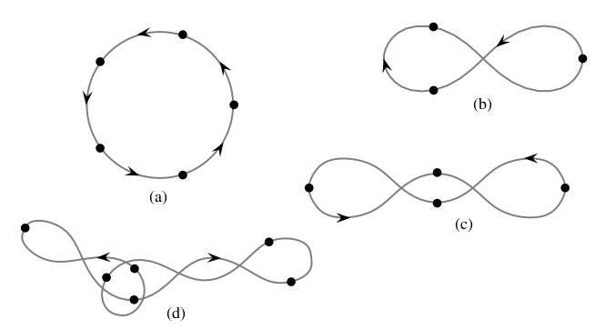
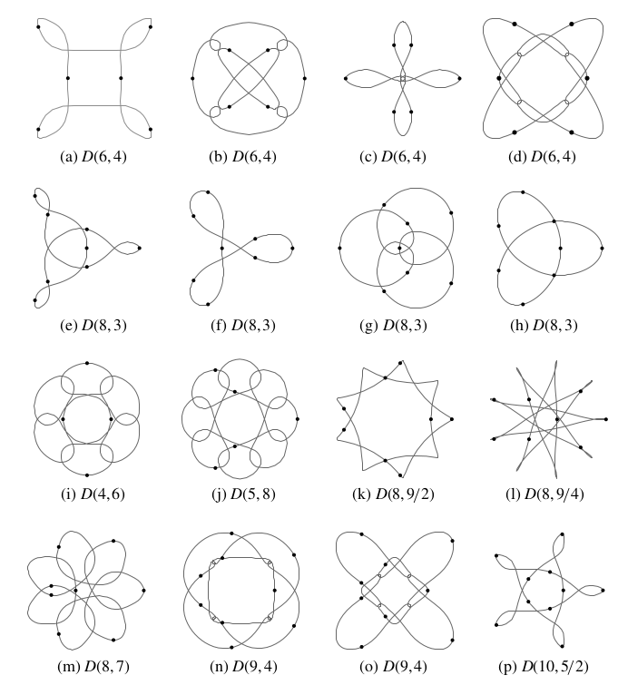
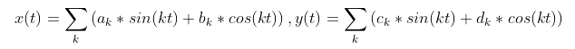
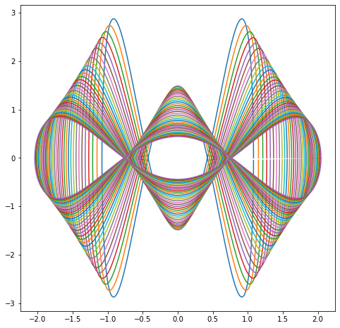

# N-body choreographies
Orbital Choreography of same-weight planets 

Sub-space of the n-body problem where the goal is to find trajectories where planets of the same weight follow eachother. 

Examples of choreographies (from this [paper](https://arxiv.org/abs/1305.0470)): 

More on n-body choreographies [here](https://en.wikipedia.org/wiki/N-body_choreography)

## On the implementation

This implemetation leverage [JAX](https://github.com/google/jax) to perform gradient descent. Starting from random shapes the Action ( integral of the lagragian IE : kinetic energy - potential energy over the trajectory) is minimized. Minima of the action represents solutions of the problem. The trajectories are built in a trigonometrical polynomial space : 

Here is an example of the optimization process.

